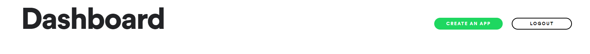
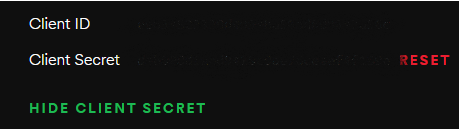
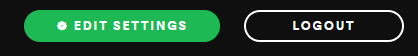
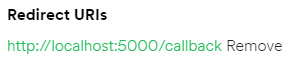
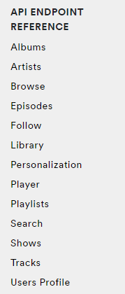
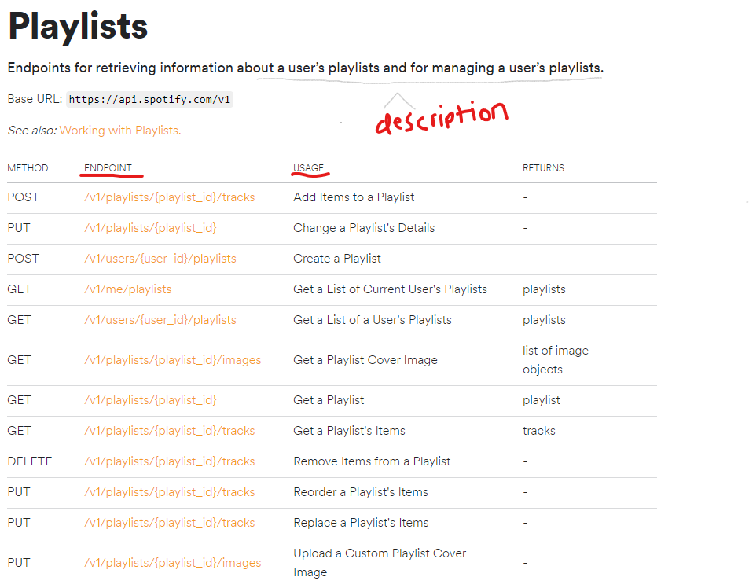
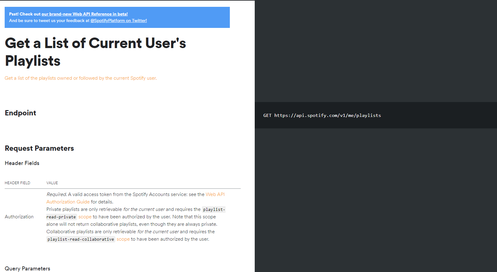
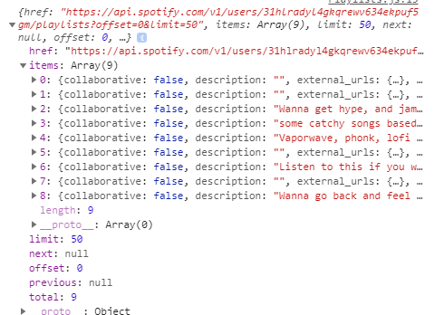
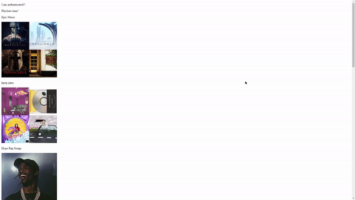

# Spotify Template

Welcome to Spotify Template. This is a template for working with Spotify's API in React and Express. This will specifically show you how to make:

- Login System (Spotify Auth)
- Making requests (sample data included as well)
- How to setup Express and React project

## Step 1: Get Started!

> Note: Everything talked about and installed will be in this repo, this is to show you how to get started!

### Create App, Install Packages.

- Create React App with following command:

```js
npx create-react-app folder-name
```

For this project, we wil call folder-name "spotify".

- Navigate to folder.

```js
cd folder-name
```

- To make requests, we will be using node-fetch. This will be demonstrated later. In the folder we navigated to, make sure to install node-fetch.

```js
npm install node-fetch
```

> Note: We are only making requests, displaying data on webpages will not be shown.

- IMPORTANT: We need to set up our proxy tag in package.json, within the folder of "spotify". Navigate to package.json file and add the following statement:

```js
"proxy": "http://localhost:5000/"
```

Please replace 5000 with whatever port you are going to use in the backend.

3000 - default port for React

5000 - port we are going to use for this project for backend

## Step 2: Backend

Ok, lets set up the backend. Create a new terminal, to the root directory of the project. We need to setup npm, so to do this, we will use:

```js
npm init
```

- IMPORTANT: Lets install all our packages we are going to use for this backend service. Run this command once you have completed the above step:

```js
npm install concurrently express request cors dotenv
```

> Note: Our main file for this backend service is going to be called "main.js". If you want too see the end result, please navigate to main.js within this repo to see the backend part of our project!

Lets run our backend and react app at the same time. We are going to be using a package called "concurrently".

- Go the package.json LOCATED in the root directory.
- Add the following statement under the scripts tag:

```js
    "server": "node main.js",
    "client": "npm start --prefix spotify",
    "dev": "concurrently \"npm run server\" \"npm run client\""
```

- Replace spotify with the folder name you gave your react app! This will allow us to run the react and express app at the same time!

- Ok, we will come back to this later. Navigate to this [link](https://developer.spotify.com/dashboard/).

## Step 3: Spotify Dashboard

- Log in with Spotify.



- Once you have logged, you may see something similar to the following image. Click "create an app".
- Give an app name, description, and agree to the terms.



- Great! You have created a spotify app!



- Click edit settings. We are going to be editing some settings of our project.



- Under redirect uri's, we need too add a redirect url where the app will redirect after the user has authenticated. We are going to be using our backend port which was 5000, and then add /callback afterwards. We will be handling this route in a bit.

- Navigate back to your project, go too root directory, and create a .env file.
- Add the following to the .env file:

```js
CLIENT_ID =
CLIENT_SECRET =
```

- Copy your client id and client secret from the app and add it after the equal sign respectively!

## Backend file

Navigate back to the backend file that we created. For this project, I will be using main.js.

- Copy the following code: (don't worry, I gave you access to use it!)

```js
//packages
require("dotenv").config();
const express = require("express");
const app = express();
const cors = require("cors");
const request = require("request");

const PORT = 5000;
const redirect_uri = `http://localhost:${PORT}/callback`;
const CLIENT_ID = process.env.CLIENT_ID;
const CLIENT_SECRET = process.env.CLIENT_SECRET;

app.use(cors({ origin: true, credentials: true }));
app.use(
  cors({
    origin: "http://localhost:3000",
    credentials: true,
  })
);

app.get("/callback", (req, res) => {
  const code = req.query.code;
  let options = {
    url: "https://accounts.spotify.com/api/token",
    form: {
      code: code,
      redirect_uri,
      grant_type: "authorization_code",
    },
    headers: {
      Authorization:
        "Basic " +
        new Buffer.from(CLIENT_ID + ":" + CLIENT_SECRET).toString("base64"),
    },
    json: true,
  };
  request.post(options, (err, response, body) => {
    let uri = "http://localhost:3000";
    res.redirect(`${uri}`);
  });
});
app.listen(PORT, console.log("Listening to 5000"));
```

- Whew! That was a lot. Lets break some stuff down:
  > We added our packages, and required them. Simple.

> Defined our ports, added our redirect uri, and got our client id and secret from our .env file.

> Get route /callback. Define the options that we want to tell Spotify after the user has authenticated. Redirect them back to the frontend using:

```js
res.redirect();
```

## Step 4: React Time!

Ok, lets go back to our react folder using:

```js
cd spotify
```

- Delete all our files in the src folder, but not the folder itself.
- Add three files in src: App.js, index.js, Spotify.js.

- Go to App.js and add the following code:

```js
import { accessUrl } from "./Spotify";

const App = () => {
  return (
    <div className="app">
      <div className="login">
        <a href={accessUrl}>Login</a>
      </div>
    </div>
  );
};
```

- This creates a simple React app. Don't worry about accessUrl, we are going to get to that in a second.

- Go to index.js, and add the following code:

```js
import App from "./App";
import React from "react";
import ReactDOM from "react-dom";
ReactDOM.render(
  <React.StrictMode>
    <App />
  </React.StrictMode>,
  document.getElementById("root")
);
```

- This renders our App component, to the root id in our index.html file (located in public folder).

- Finally, lets go to Spotify.js. I will be breaking down this code, but for now, add the following:

```js
const authEndpoint = "https://accounts.spotify.com/authorize";
require("dotenv").config();
const CLIENT_ID = "";
const redirectUri = "http://localhost:5000/callback";
const scopes = [
  "ugc-image-upload",
  "user-read-recently-played",
  "user-top-read",
  "user-read-playback-position",
  "user-read-playback-state",
  "user-modify-playback-state",
  "user-read-currently-playing",
  "app-remote-control",
  "streaming",
  "playlist-modify-public",
  "playlist-modify-private",
  "playlist-read-private",
  "playlist-read-collaborative",
  "user-follow-modify",
  "user-follow-read",
  "user-library-modify",
  "user-library-read",
  "user-read-email",
  "user-read-private",
];

export const SpotifyToken = () => {
  return window.location.hash
    .substring(1)
    .split("&")
    .reduce((initial, item) => {
      var parts = item.split("=");
      initial[parts[0]] = decodeURIComponent(parts[1]);

      return initial;
    }, {});
};

export const accessUrl = `${authEndpoint}?client_id=${CLIENT_ID}&redirect_uri=${redirectUri}&scope=${scopes.join(
  "%20"
)}&response_type=token&show_dialog=true`;
```

- Replace CLIENT_ID with the client id that we added from our Spotify app earlier.

## Step 5: Break down Spotify.js.

Ok, lets break it down.

> We defined our client id, added scopes, which you can change based on what you want to access from the user. These are all the available scopes Spotify provides.

- This code:

```js
export const SpotifyToken = () => {
  return window.location.hash
    .substring(1)
    .split("&")
    .reduce((initial, item) => {
      var parts = item.split("=");
      initial[parts[0]] = decodeURIComponent(parts[1]);

      return initial;
    }, {});
};
```

Is a bit complicated to understand. Just know that this is going to return the access token.

## Step 5: Requests

- Lets update our App.js file, so that if we have the token, we can let the user go onto another page. Now we can start making requests to Spotify.

```js
//App.js
import { accessUrl } from "./Spotify";
import { SpotifyToken } from "./Spotify";
import { useState, useEffect } from "react";

const App = () => {
  const [token, setToken] = useState(" ");
  useEffect(() => {
    const hash = SpotifyToken();
    window.location.hash = "";
    const _token = hash.access_token;
    if (_token) {
      setToken(_token);
    }
  }, []);
  return (
    <div className="app">
      {token === " " ? (
        <div className="login">
          <a href={accessUrl}>Login</a>
        </div>
      ) : (
        <div className="welcome">
          \<p>I am authenticated!!</p>
        </div>
      )}
    </div>
  );
};

export default App;
```

- Break down time!

We are going to use useState and useEffect here. The initial state of the token will be blank, however, if the window.location.hash changes, then we set that to our state. We can get the access token from this aswell, which we can make requests with!

If the token equals an empty string, then we want them to see the login page so we can authenticate them. If its not, then we will do some other neat stuff!

- Test time! Lets test too see if it works. Run following statement in terminal:

```js
npm run dev
```

You should see, once logged in.

```html
I am authenticated!!
```

Congrats, you have now completed the authentication part of the project! Lets keep rolling!

# How to get data?

## Lets talk about how to get data now!

### Step 1: Where can I find data to get?

Head over to this [link](https://developer.spotify.com/documentation/web-api/reference/).



You might notice this to the left! Welcome! This is where the endpoints, or data we can recieve from Spotify. Now we just make requests to these endpoints. In this particular tutorial, we will be making a request to the "Playlists" endpoint, to get users playlists and display them!

- Click on playlists.



You might notice that you see a bunch of endpoints. Spotify does a good job of listing what each endpoint is, and what they can do. Specifically, we want to get users playlists, so we will make a request to /v1/me/playlists. Lets click on that link.



Perfect. This is exactly what we want. Notice the header fields. We need to make a request with the authorization header, specifically with the access token. Lets do that now.

- Navigate back to App.js within the src folder.

Here is what it should look like now:

```js
import { accessUrl } from "./Spotify";
import { SpotifyToken } from "./Spotify";
import { useState, useEffect } from "react";

const App = () => {
  const [token, setToken] = useState(" ");
  useEffect(() => {
    const hash = SpotifyToken();
    window.location.hash = "";
    const _token = hash.access_token;
    if (_token) {
      setToken(_token);
    }
  }, []);
  return (
    <div className="app">
      {token === " " ? (
        <div className="login">
          <a href={accessUrl}>Login</a>
        </div>
      ) : (
        <div className="welcome">
          <p>I am authenticated!!</p>
        </div>
      )}
    </div>
  );
};

export default App;
```

Lets change that.

- Lets start off by going to the useEffect component. This is the perfect place to make the request. Make sure you have node-fetch installed.

```js
npm i node-fetch
// install if you haven't already
```

Ok, lets get users playlists now!

- Create a new component called Playlists.js. We are going to import it in our app. Lets just work on getting Playlists.js coded and ready!

Playlists.js :

```js
import { useEffect, useState } from "react";
import fetch from "node-fetch";

const Playlists = (props) => {
  const [playlistItems, setPlaylistItems] = useState([]);
  useEffect(() => {
    fetch("https://api.spotify.com/v1/me/playlists?limit=50", {
      headers: {
        Authorization: "Bearer " + props.token,
      },
    })
      .then((res) => res.json())
      .then((data) => {
        console.log(data);
        setPlaylistItems(data.items);
      });
  }, []);
  return <div className="playlists">Playlists time!</div>;
};

export default Playlists;
```

- Yes! We have made the request to spotify, to this endpoint. We also added ?limit=50 to get a max of 50 playlists at a time. We also created a playlistItems state, and we set that equal to data.items, which if you see here:



Is equal to the playlists we have on the user that was authenticated. There's a lot more data packed into it, which we will get into now!

- Lets get all the images of the playlist. We are going to use Array.map() for this purpose.

Updated code:

```js
import { useEffect, useState } from "react";
import fetch from "node-fetch";

const Playlists = (props) => {
  const [playlistItems, setPlaylistItems] = useState([]);
  useEffect(() => {
    fetch("https://api.spotify.com/v1/me/playlists?limit=50", {
      headers: {
        Authorization: "Bearer " + props.token,
      },
    })
      .then((res) => res.json())
      .then((data) => {
        console.log(data);
        data.items.map((items) => {
          return console.log(items.images[0]);
        });
        setPlaylistItems(data.items);
      });
  }, []);
  return (
    <div className="playlists">
      Playlists time!
      {playlistItems.map((playlists) => {
        return (
          <div className="image-track">
            <p>{playlists.name}</p>
            
          </div>
        );
      })}
    </div>
  );
};

export default Playlists;
```

### Result!



Don't forget to import Playlists from App.js!

App.js

```js
//put import statement at top of App.js
import Playlists from ./Playlists.js


//inside return statement of App.js
return (
    <div className="app">
      {token === " " ? (
        <div className="login">
          <a href={accessUrl}>Login</a>
        </div>
      ) : (
        <div className="welcome">
          <p>I am authenticated!!</p>
          <Playlists token={token} />
        </div>
      )}
    </div>
  );
```

> Note: We will not be styling the playlists, this was just to show you how to work with API endpoints.

- There you go. Now you know how to start with Spotify's API.

# Help / Q&A

- For all help, please contact me at praveshk04@outlook.com! This was a short tutorial, but I hope it got you started! If you would like a video on this, I will be making one soon! Thank you for reading this tutorial.
